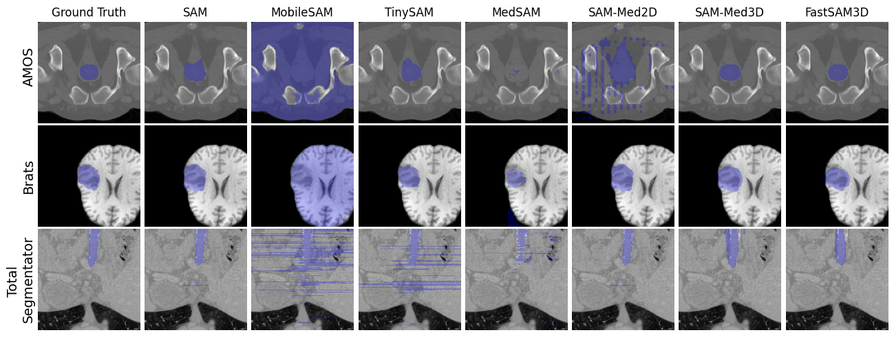

# FastSam3D-CVPR25


---


##  Getting Started

**System Requirements:**

* **Python**: `version 3.9 or above`
* **CUDA**: `version 12.1`
* **FLASH Attention support GPU**: `Ampere, Ada, or Hopper GPUs (e.g., A100, RTX 3090, RTX 4090, H100).`


###  Installation

<h4>From <code>source</code></h4>

> 1. Clone the FastSAM3D-v1 repository:
>
> ```console
> $ git clone https://github.com/skill-diver/FastSAM3D-v1
> ```
>
> 2. Change to the project directory:
> ```console
> $ cd FastSAM3D-v1
> ```
>
> 3. Install the dependencies:
> ```console
> $ pip install -r requirements.txt


###  Usage

<h4>From <code>source</code></h4>

> 1.Prepare Your Training Data (from nnU-Net-style dataset): 

> Ensure that your training data is organized according to the structure shown in the `data/medical_preprocessed` directories. The target file structures should be like the following:
> ```
> data/medical_preprocessed
>       ├── adrenal
>       │ ├── ct_WORD
>       │ │ ├── imagesTr
>       │ │ │ ├── word_0025.nii.gz
>       │ │ │ ├── ...
>       │ │ ├── labelsTr
>       │ │ │ ├── word_0025.nii.gz
>       │ │ │ ├── ...
>       ├── ...
> ```

---

## 🔧 步骤说明

### 1 将所有 `gts_npz` 中的标签 `.npz` 转换为 `label.nii.gz`

从每个 `.npz` 文件中提取 `gts.npy`，并保存为 `label.nii.gz` 格式，写入到 `labels/` 文件夹中。
>    ```console
>    python label_nii.py
>    ```
---

### 2 根据 `CVPR25.json` 的顶层键，将对应的 `label.nii.gz` 分类

- 读取 `CVPR25.json` 顶层键
- 遍历 `labels/` 中的 `label.nii.gz`
  - 如果键名匹配：
    - 在指定文件夹中以键名创建子文件夹
    - 将对应的 `label.nii.gz` 移动到该子文件夹中
  - 如果键名不匹配：
    - 不做处理，保留在 `labels/` 中

>    ```console
>    python classify.py
>    ```

---

### 3 对剩余未匹配的 `label.nii.gz`，更新 JSON 文件

使用特定规则为这些文件提取新的键名，并更新到 `CVPR25.json` 中。

>    ```console
>    python renew_json.py
>    ```

可直接使用 `CVPR25.JSON`文件。

---

### 4 按照 JSON 文件中的标签定义，对每个标签进行提取并分类存储

- 对 `label.nii.gz` 中的每个标签进行分割提取
- 根据标签名创建对应子文件夹
- 将提取的标签图像保存至对应子文件夹下

>    ```console
>    python renew_classify.py
>    ```

---

### 5 将 `image.npz` 中的 `imgs.npy` 转换为 `image.nii.gz`

- 读取 `imgs.npy` 并保存为 `image.nii.gz` 格式

>    ```console
>    python image_nii.py
>    ```

---

### 6 移动 `image.nii.gz` 到每个器官子文件夹的 `imagesTr/` 中

- 每个器官子文件夹内新建 `imagesTr/`
- 将对应的 `image.nii.gz` 移动进去

>    ```console
>    python reallocate.py
>    ```

---

### 7 重命名图像和标签文件，去除后缀 `_image` 和 `_label`

>    ```console
>    python same_name.py
>    ```

---


### 8 根据自己的数据来修改 `utils/data_paths.py` 
> ```
> img_datas = [
> "data/train/adrenal/ct_WORD",
> "data/train/liver/ct_WORD",
> ...
> ]
> ```

### 9 Train the Teacher Model and Prepare Labels(logits)
>
>    Use the command below to train the teacher model and prepare labels for guided distillation to the student model, and put your data and checkpoint in the corresponding position of the shell script:
>    ```console
>    $ ./preparelabel.sh
>    ```
>
### 10 Distill the Model
>
>    To distill the model, run the following command. The distilled checkpoint will be stored in `work_dir`, and put your data and checkpoint in the corresponding position of shell script:
>    ```console
>    $ ./distillation.sh
>
>    ```
>
### 11 Validate the Teacher Model
>
>    Validate the teacher model using the command below, and put your data and teacher model (link below) checkpoint in the corresponding position of shell script:
>    ```console
>    $ ./validation.sh
>    ```
>
### 12 Validate our FastSAM3D model, or your distilled student model
>
>    Finally, to validate the student model after distillation, and put your data, teacher model, FastSAM3D model checkpoint(link below) in the corresponding position of the shell script:
>    ```console
>    $ ./validation_student.sh
>    ```


### 13 保存模型预测结果 `pred4`

将模型预测的第 4 个版本结果（`pred4`）保存为指定格式，结构与原始标签一致。

>    ```console
>    python save_pred4.py
>    ```

---

### 14 验证集结果转换为 `.npz` 格式并保存

- 将验证集的预测结果（如 `.nii.gz`）转换为 `.npz` 格式
- 每个 `.npz` 包含两个键：
  - `labels.npy`
  - `spacing.npy`
- 所有 `.npz` 保存在一个统一的输出文件夹中

>    ```console
>    python convert_npz.py
>    ```

---

## 权重

Below are the links to the checkpoints for FastSAM3D and its fine-tuned version:

| Model                | Download Link |
|----------------------|---------------|
| FASTSAM3D            | [Download](https://huggingface.co/techlove/FastSAM3D/tree/main) |
| Teacher Model        | [Download](https://huggingface.co/blueyo0/SAM-Med3D/blob/main/sam_med3d_turbo.pth) |

---
##  Visualize
<div align="center">
  
</div>
##  Contributing

Contributions are welcome! Here are several ways you can contribute:

- **[Report Issues](https://github.com/skill-diver/FastSAM3D-v1/issues)**: Submit bugs found or log feature requests for the `FastSAM3D-v1` project.
- **[Submit Pull Requests](https://github.com/skill-diver/FastSAM3D-v1/blob/main/CONTRIBUTING.md)**: Review open PRs, and submit your own PRs.
- **[Join the Discussions](https://github.com/skill-diver/FastSAM3D-v1/discussions)**: Share your insights, provide feedback, or ask questions.

<details closed>
<summary>Contributor Graph</summary>
<br>
<p align="center">
   <a href="https://github.com{/skill-diver/FastSAM3D-v1/}graphs/contributors">
      
   </a>
</p>
</details>

---

##  License

This project is protected under the [Apache 2.0 license](LICENSE). 

---

## Citation

```
@misc{shen2024fastsam3d,
      title={FastSAM3D: An Efficient Segment Anything Model for 3D Volumetric Medical Images}, 
      author={Yiqing Shen and Jingxing Li and Xinyuan Shao and Blanca Inigo Romillo and Ankush Jindal and David Dreizin and Mathias Unberath},
      year={2024},
      eprint={2403.09827},
      archivePrefix={arXiv},
      primaryClass={eess.IV}
}
```
---

##  Acknowledgement
- Thanks to the open-source of the following projects:
  - [Segment Anything](https://github.com/facebookresearch/segment-anything) &#8194;
  - [SAM-Med3D](https://github.com/uni-medical/SAM-Med3D)

---
